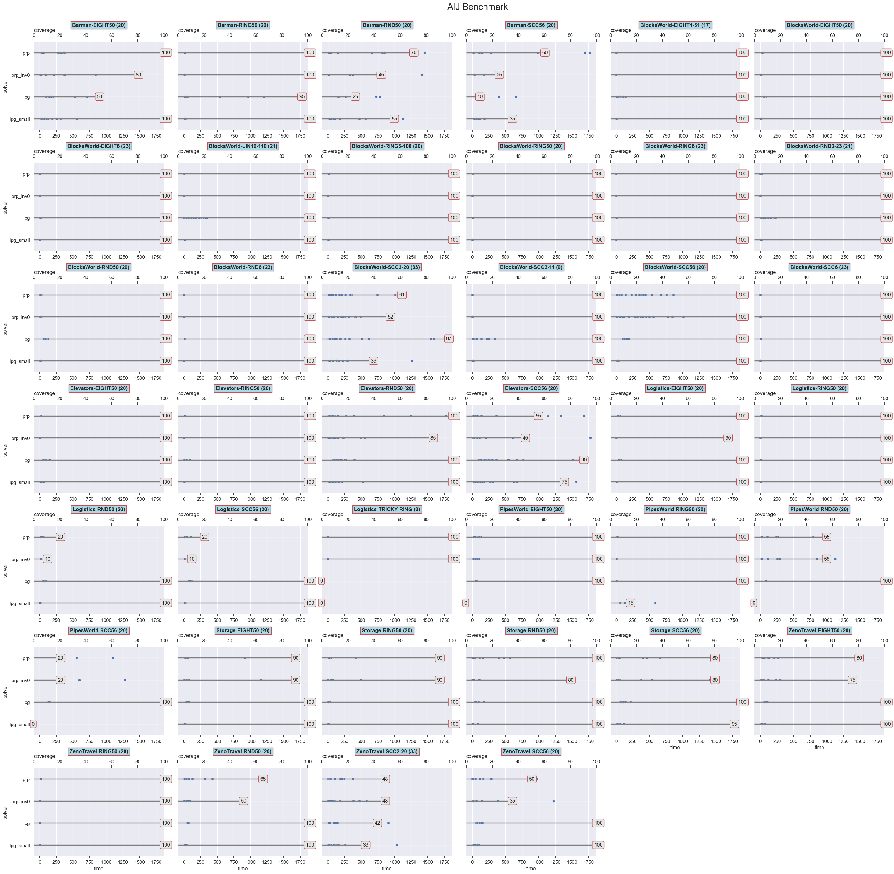
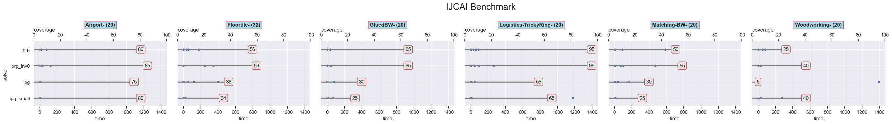
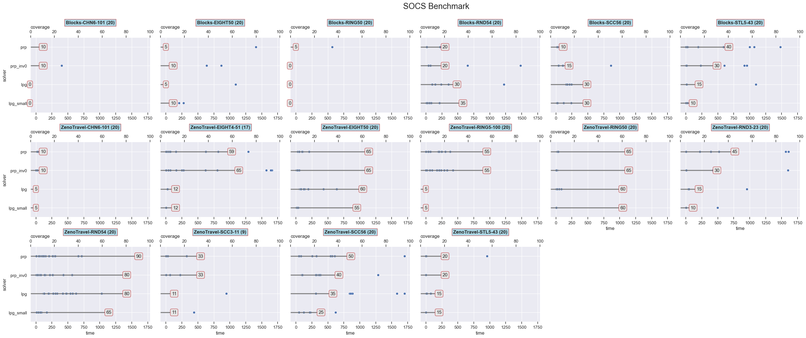
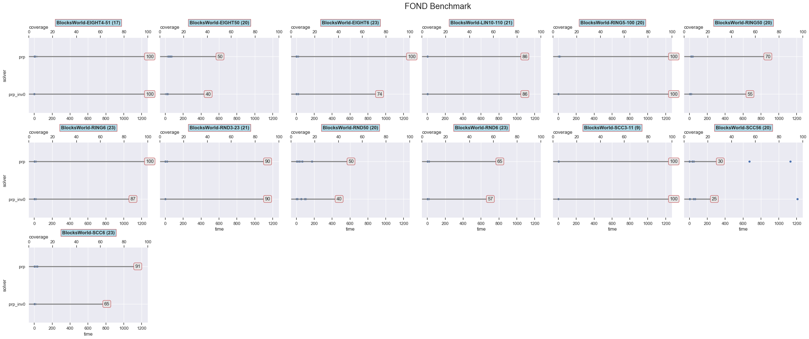

# Experiments

Experiments were run on various benchmark sets and solvers.

## Solvers tested

- [PP-LPG APP](https://github.com/ssardina-research/app-lpg) solver (as per AIJ16 paper) under two configurations:
  - `lpg`: standard configuration of solver for large problems.
  - `lpg_small`:  configuration of solver for small problems.
- FOND encoding using [PRP](https://github.com/ssardina-research/planner-for-relevant-policies/):
  - `prp`: with standard invariant set to 300s
  - `prp_inv0`: with invariant extraction disabled
- FOND encoding using [PR2 FOND planner] (the new version of PRP):
  - `prp2`: with standard invariant set to 300s
  - `prp2_inv0`: with invariant extraction disabled
- FOND encoding using [Paladinus FOND planner](https://github.com/ssardina-research/paladinus):
  - `paladinus`: used with the reported optimnal configuration: `-search ITERATIVE_DFS_PRUNING -heuristic HADD -actionSelectionCriterion MIN_MAX_H -evaluationFunctionCriterion MAX` and 1.5Gb of heap RAM (`-Xmx1500m`).

## Resources

- Time limti: 1800s (30')
- Memory limit: 2GB

## Benchmarks

Benchmarks used under `benchmarks/`:

1. **AIJ**: the benchmark used in the [AIJ'16](https://doi.org/10.1016/j.artint.2015.10.001) paper. All deterministic and with no-dead ends except Logistics. This is where the PP-LPG solver was proposed.
2. **IJCAI**: benchmark used at [IJCAI'17](https://doi.org/10.24963/ijcai.2017/135) using dead-end reasoning.
3. **SOCS**: benchmark used in [SOCS'17 paper]() for dead-ends: [On Realizing Planning Programs in Domains with Dead-End States](https://aaai.org/papers/00020-18431-on-realizing-planning-programs-in-domains-with-dead-end-states/).
4. **FOND**: new benchmark where underlying theory is already non-deterministic. These are only relevant for PRP and PRP2.

## How it was run via Benchexec

We used Benchexec framework; see [BENCHMARKING.md](../BENCHMARKING.md) for details.

Benchexec configurations are under [benchexe/](/benchexe/).

To run the benchmarks we need to make sure that:

1. We are on a Python virtual environment that has Benchexec and all other required Python modules.
2. Python can find module/package `benchexec.tools` that contains the tools used. This is done by setting [PYTHONPATH](https://docs.python.org/3/using/cmdline.html#envvar-PYTHONPATH).
3. All binaries used by the tools are accessible from the `PATH`.

We can do all that as follows:

```shell
$ python -m venv ~/my_virtualenv/app
$ source ~/virtualenv/app/bin/activate
$ pip install -r requirements_extra.txt   # this will install Benchexec 

$ which benchexec # confirm it was installed correctly
/home/ssardina/virtualenv/app/bin/benchexec

$ export PATH=$PATH:$PWD/bin
$ export PYTHONPATH=$PWD/src/python
```

Then, to run each solver we specify its corresponding Benchexec **benchmark definition** XML file, which contains the various solvers to use and the tasks to run.

The following command runs the benchmark for the PALADINUS FOND-based solver (from repo root folder):

```shell
$ benchexec experiments/benchexe/benchmark-paladinus.xml -N 8 -c 1 --tool-directory src/python/ --read-only-dir / --overlay-dir /mnt/projects/app/app.git -o /mnt/data/app/2024.06.10-paladinus/
```
where:

* `-N`: number of parallel runs;
* `-c`: number of CPUs per task;
* `--tool-directory`: specifies the folder where the tools' executables (e.g., `pp-fond.py`) are located.
* `--overlay-dir`: container mounts an overlay on folder (full read and write access; but writes are done in virtual memory);
* `--read-only-dir`: container has read access to folder (all the file-system in the example);
* `-n`: name id given to the experiment; and
* `-o`: location where the outputs should be saved.

Notice we use 8 cores as that provides stable results.

After Bechexec completes all the tasks for a benchmark, the results are left as compressed files (logs, outputs, results, etc.). We can then run the `table-generator` command to extract the results into CSV file (Benchexec will automatically print the exact command that needs to be executed at the end of the experiment). For example:

```$ table-generator /mnt/data/app/2024.05.06/benchmark-prp2.prp2.2024-05-06_11-07-17.results.prp.xml.bz2 /mnt/data/app/2024.05.06/benchmark-prp.prp.2024-05-06_11-07-17.results.prp2_inv0.xml.bz2```

This will generate a CSV and HTML files with all results of the experiment.

## Result Analysis & Plotting
Results from Benchexec can be found under the folder [results](./results/).

Analysis was done via jupyter notebook [analysis_benchexec](../analysis_benchexec.ipynb), and plotting was done both in R and Jupyter.

The notebook can read many Benchexec CSV result files (obtained via `table-generator` as above) into a single Pandas Dataframe for statistical analysis and plotting. Just make sure all CSV files `results_XXX.csv` are in the same folder and the notebook will load them all. 

Remember that in every result CSV file, many tasks (e.g., instances) could have been tested against different _**runs**_ (e.g., solver configurations within the same tool), like `prp` and `prp_inv0`, or `lpg` and `lpg_small`. Each run will have its result in own columns (for the same set of tasks). So, the notebook reshapes all those columns to make the run names (e.g., `prp` or `lpg_small`) a single `run` column identifying both the solver and its variant configuration. This makes dataframes much more amenable for analysis. The notebook writes collected results to a file called `results.csv` in the results folder.

Here are some plots per benchmark.

### AIJ Benchmark



### IJCAI Benchmark



### SOCS Benchmark



### FOND Benchmark


